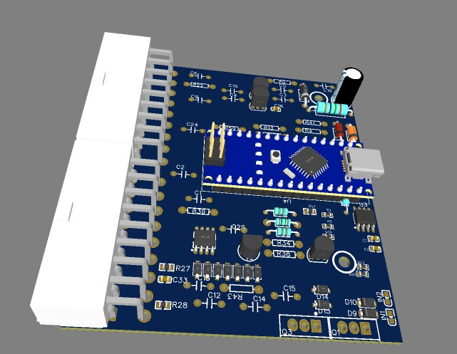
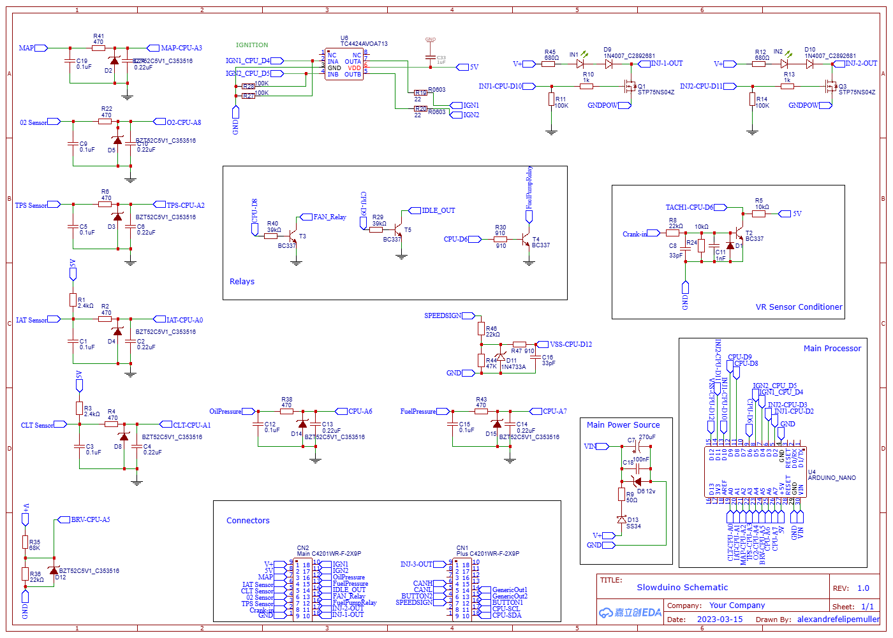

# Slowduino
## Super Lowcost Speeduino
Slowduino is the fastest way to go from an inexpensive Arduino to a working EFI controller that plays nicely with the official Speeduino tooling. It keeps the same 16×16 maps, protocol, and tuning feel yet runs on an ATmega328p (Uno/Nano) while borrowing only the best ideas from the Speeduino firmware.

Slowduino is for DIY tuners, hobbyists, educators, and anyone who wants to build a full-featured ECU without the premium price tag. The project ships with ignition control, injection scheduling, sensor support, protective cut logic, and TunerStudio compatibility—everything you need to boot a motor in a garage, classroom, or lean workshop.

## Visual Tour

*Slowduino board layout rendered for reference.*

## Circuit Diagram

*Injection and ignition wiring overview for the Slowduino board.*

### Highlights
- Runs on **Arduino Uno/Nano** or Speeduino v0.4 hardware with the same peripheral set and protocol.
- **16×16 VE + Ignition tables**, closed-loop narrowband control, and Speeduino-style CRC pages for TunerStudio.
- Deterministic **Timer1-based scheduler** keeps ignition/injection timing inside 20 µs even at 8 000 RPM.
- Full sensor stack: MAP, TPS, CLT, IAT, O2, battery, oil pressure, fuel pressure, fan, pump, and IAC.
- **Engine protections** inspired by Speeduino (RPM cut + oil-pressure monitoring) that gate fuel and spark when you need them.

## Explore the Project
Navigate the docs to learn how to build, tune, and extend Slowduino:
- [Overview](docs/overview.md): What Slowduino is, why it exists, and how it compares to Speeduino.
- [Technical Specifications](docs/specifications.md): Hardware platforms, sensors, tables, timing, and EEPROM layout.
- [Getting Started](docs/getting-started.md): Hardware list, firmware configuration, uploading, and basic calibration.
- [Communication & Debug](docs/communication-and-debug.md): TunerStudio protocol, serial diagnostics, and troubleshooting tips.
- [Performance & Roadmap](docs/performance.md): Resource budgets, current limitations, and where we are headed.
- [Contributing & References](docs/contributing.md): How to help, disclaimers, and essential references.

Ready to flash a board? Start with **Getting Started** and keep this repo bookmarked for reference. Slowduino turns a generic Arduino into a reliable ECU—no custom silicon, no magic.
